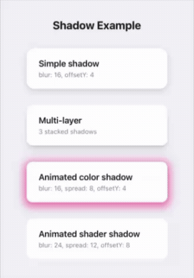

# react-native-skia-box-shadow

CSS-style box shadows for React Native — blur, spread, offset, color animation, gradient fills, and arbitrary shapes.
All at 60fps on the UI thread.

Powered by [`@shopify/react-native-skia`](https://shopify.github.io/react-native-skia/).

This is a React Native port of the Compose Multiplatform library [
`vasyl-stetsiuk/shadow`](https://github.com/vasyl-stetsiuk/shadow).

## Preview


## Features

- **Blur** — Gaussian blur with no sigma limit (Skia ImageFilter)
- **Spread** — expand or shrink shadow beyond element bounds
- **Offset** — horizontal and vertical positioning
- **Color animation** — animate shadow color via `SharedValue<string>`
- **Border radius animation** — animate `radius` for shape transitions
- **Gradient fill** — custom Skia shader factory for gradient shadows
- **Multi-layer** — multiple shadows in a single component
- **Arbitrary shapes** — rect, roundedRect, circle, SVG path
- **Figma-compatible** — blur values match Figma 1:1
- **Wraps native Views** — unlike Skia's built-in `<Shadow>`, this works with any RN component

## Installation

```bash
npm install react-native-skia-box-shadow @shopify/react-native-skia react-native-reanimated
```

> **Peer dependencies:**
> - `@shopify/react-native-skia` >= 1.0.0
> - `react-native-reanimated` >= 3.0.0

## Usage

### Static shadow

```tsx
import {Shadow} from 'react-native-skia-box-shadow';

<Shadow
    shadows={{
        blurRadius: 16,
        offsetY: 4,
        fillStyle: {kind: 'color', color: 'rgba(0,0,0,0.15)'},
    }}
    shape={{kind: 'roundedRect', radius: 16}}
>
    <View style={styles.card}>
        <Text>Card with shadow</Text>
    </View>
</Shadow>
```

### Animated shadow (blur, spread, offset)

```tsx
import {Shadow} from 'react-native-skia-box-shadow';
import {useSharedValue, withSpring} from 'react-native-reanimated';

const MyCard = () => {
    const blur = useSharedValue(16);
    const offsetY = useSharedValue(4);
    const spread = useSharedValue(0);

    const onPressIn = () => {
        blur.value = withSpring(32);
        offsetY.value = withSpring(12);
        spread.value = withSpring(4);
    };

    const onPressOut = () => {
        blur.value = withSpring(16);
        offsetY.value = withSpring(4);
        spread.value = withSpring(0);
    };

    return (
        <Shadow
            shadows={{
                blurRadius: blur,
                offsetY,
                spread,
                fillStyle: {kind: 'color', color: 'rgba(0,0,0,0.15)'},
            }}
            shape={{kind: 'roundedRect', radius: 16}}
            maxCanvasPadding={150}
        >
            <Pressable onPressIn={onPressIn} onPressOut={onPressOut}>
                <View style={styles.card}>
                    <Text>Press me</Text>
                </View>
            </Pressable>
        </Shadow>
    );
};
```

### Animated color

```tsx
import {useSharedValue, withTiming} from 'react-native-reanimated';

const shadowColor = useSharedValue('rgba(0,0,0,0.15)');

const onFocus = () => {
    shadowColor.value = withTiming('rgba(59,130,246,0.4)');
};

<Shadow
    shadows={{
        blurRadius: 16,
        offsetY: 4,
        fillStyle: {kind: 'color', color: shadowColor},
    }}
    shape={{kind: 'roundedRect', radius: 16}}
    maxCanvasPadding={120}
>
    <View style={styles.card}>
        <Text>Blue glow on focus</Text>
    </View>
</Shadow>
```

> **Note:** For color interpolation inside Skia components, use `interpolateColors` from `@shopify/react-native-skia`,
> not `interpolateColor` from `react-native-reanimated`. Using Reanimated's version may cause colors to flash black during
> animation.

### Animated border radius

```tsx
const radius = useSharedValue(16);

const onExpand = () => {
    radius.value = withSpring(0);
};

<Shadow
    shadows={{blurRadius: 16, offsetY: 4}}
    shape={{kind: 'roundedRect', radius}}
    maxCanvasPadding={120}
>
    <View style={styles.card}>
        <Text>Morphing corners</Text>
    </View>
</Shadow>
```

### Multi-layer shadow

```tsx
<Shadow
    shadows={[
        {
            blurRadius: 4,
            offsetY: 2,
            fillStyle: {kind: 'color', color: 'rgba(0,0,0,0.12)'},
        },
        {
            blurRadius: 24,
            offsetY: 8,
            spread: 4,
            fillStyle: {kind: 'color', color: 'rgba(0,0,0,0.08)'},
        },
    ]}
    shape={{kind: 'roundedRect', radius: 16}}
>
    <View style={styles.card}>
        <Text>Layered shadow</Text>
    </View>
</Shadow>
```

### Gradient shadow

```tsx
import {LinearGradient, vec} from '@shopify/react-native-skia';

<Shadow
    shadows={{
        blurRadius: 24,
        offsetY: 8,
        fillStyle: {
            kind: 'shader',
            factory: (w, h) =>
                LinearGradient(
                    vec(0, 0),
                    vec(w, h),
                    ['#ff6b6b', '#4ecdc4'],
                ),
        },
    }}
    shape={{kind: 'roundedRect', radius: 16}}
>
    <View style={styles.card}>
        <Text>Gradient shadow</Text>
    </View>
</Shadow>
```

### Auto-sizing (no explicit width/height)

```tsx
<Shadow
    shadows={{blurRadius: 16, offsetY: 4}}
    shape={{kind: 'roundedRect', radius: 16}}
>
    <View style={styles.card}>
        <Text>Auto-sized</Text>
    </View>
</Shadow>
```

The component measures itself via `onLayout` when `width`/`height` are omitted.

## API

### `<Shadow>` Props

| Prop               | Type                             | Default            | Description                           |
|--------------------|----------------------------------|--------------------|---------------------------------------|
| `shadows`          | `ShadowParams \| ShadowParams[]` | required           | One or more shadow layers             |
| `shape`            | `ShadowShape`                    | `{ kind: 'rect' }` | Default shape for all layers          |
| `width`            | `number`                         | auto               | Explicit component width              |
| `height`           | `number`                         | auto               | Explicit component height             |
| `maxCanvasPadding` | `number`                         | auto / 120         | Max canvas extent for animated values |
| `style`            | `ViewStyle`                      | —                  | Style for the outer container         |
| `children`         | `ReactNode`                      | —                  | Content rendered above the shadow     |

### `ShadowParams`

All numeric values accept `number | SharedValue<number>`.

| Prop         | Type                 | Default     | Description                             |
|--------------|----------------------|-------------|-----------------------------------------|
| `fillStyle`  | `ShadowFillStyle`    | black @ 10% | Color or shader fill                    |
| `blurRadius` | `Animatable<number>` | `24`        | Gaussian blur radius (Figma-compatible) |
| `spread`     | `Animatable<number>` | `4`         | Expand shadow beyond bounds             |
| `offsetX`    | `Animatable<number>` | `0`         | Horizontal offset                       |
| `offsetY`    | `Animatable<number>` | `0`         | Vertical offset                         |
| `shape`      | `ShadowShape`        | inherits    | Per-layer shape override                |

### `ShadowFillStyle`

| Kind     | Props                         | Description                                  |
|----------|-------------------------------|----------------------------------------------|
| `color`  | `color: Animatable<string>`   | Solid color (supports `SharedValue<string>`) |
| `shader` | `factory: (w, h) => SkShader` | Custom Skia shader (gradients, etc.)         |

### `ShadowShape`

| Kind          | Props                        | Description        |
|---------------|------------------------------|--------------------|
| `rect`        | —                            | Rectangle          |
| `roundedRect` | `radius: Animatable<number>` | Rounded rectangle  |
| `circle`      | —                            | Circle             |
| `path`        | `svgPath: string`            | Arbitrary SVG path |

## `maxCanvasPadding`

When all shadow props are static, the canvas padding is auto-calculated to exactly fit the shadow. When any prop is a
`SharedValue`, the final extent is unknown at render time, so you need to provide `maxCanvasPadding` — the maximum
number of points the shadow can extend beyond the element.

Rule of thumb: `maxCanvasPadding` ≥ `blur × 3 + spread + max(offsetX, offsetY)` at the shadow's maximum animated state.

If omitted with animated values, defaults to `120`.

## How it works

The component renders a Skia `<Canvas>` behind your children. Each shadow layer draws a shape (matching your content's
shape) with a Gaussian blur applied as an ImageFilter. The canvas is automatically expanded to prevent clipping. All
animated values are read on the UI thread via `useDerivedValue` — zero React re-renders during animation.

## License

MIT © [Vasyl Stetsiuk](https://stetsiuk.dev)
